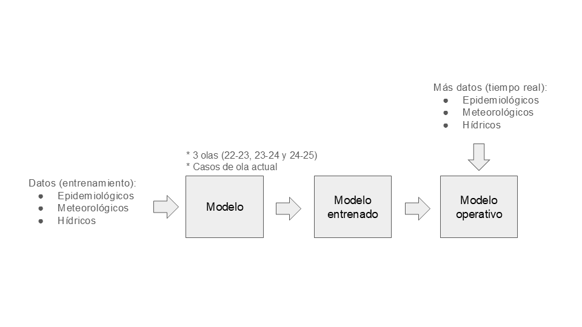

# Modelos para predicción de Dengue
Código para la ejecución de modelos de Machine Learning para la predicción de Dengue en Argentina con 2 semanas de anticipación.

## Clonado de repositorio
Para clonar el repositorio en tu equipo de trabajo, escriba el siguiente comando desde una terminal del sistema operativo:
```
$ git clone https://github.com/Gonzalo1985/DengueMods
```

Los datos para su ejecución no se encuentran disponibles.

## Flujo de trabajo
